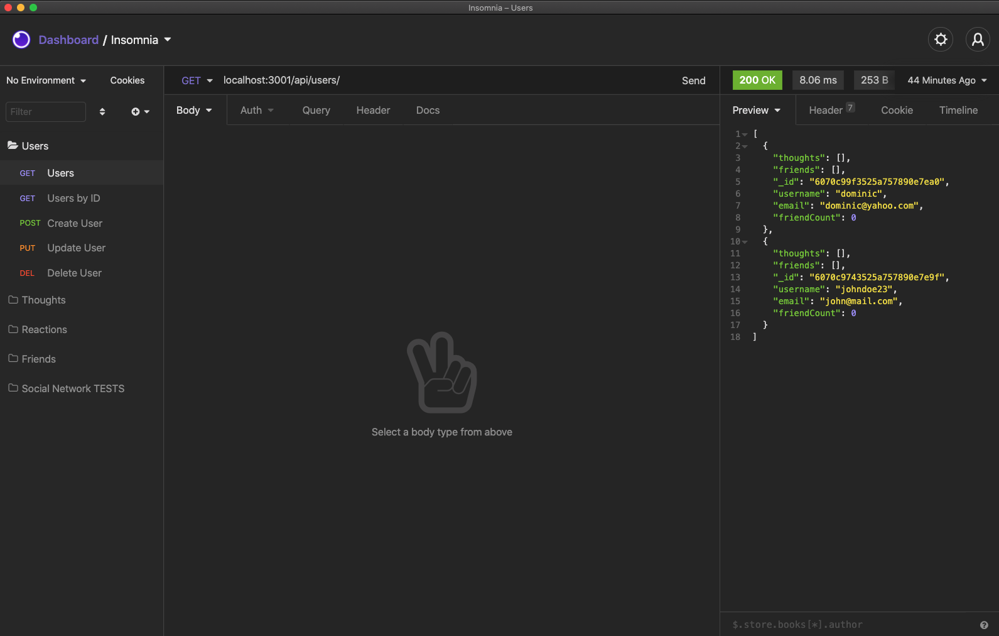
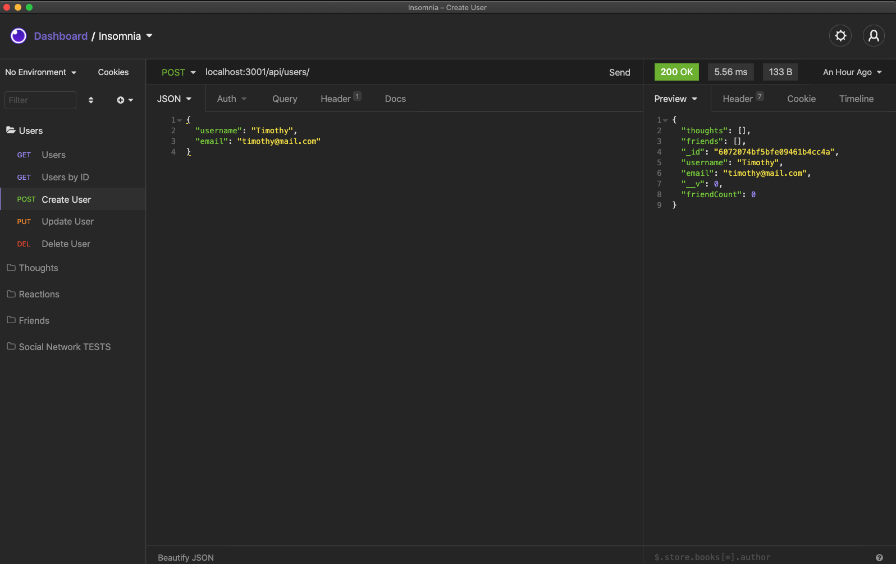
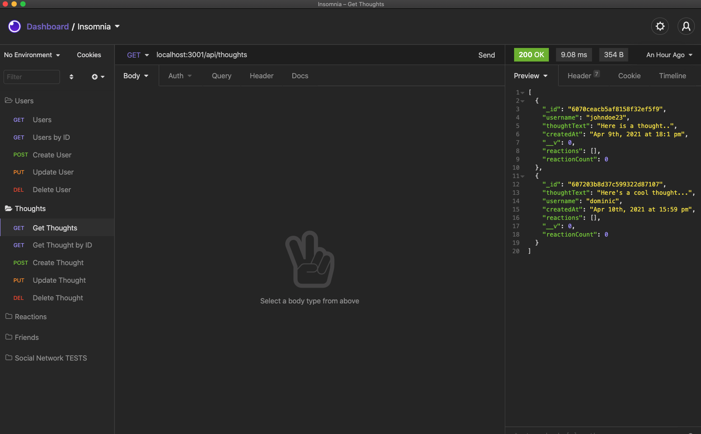
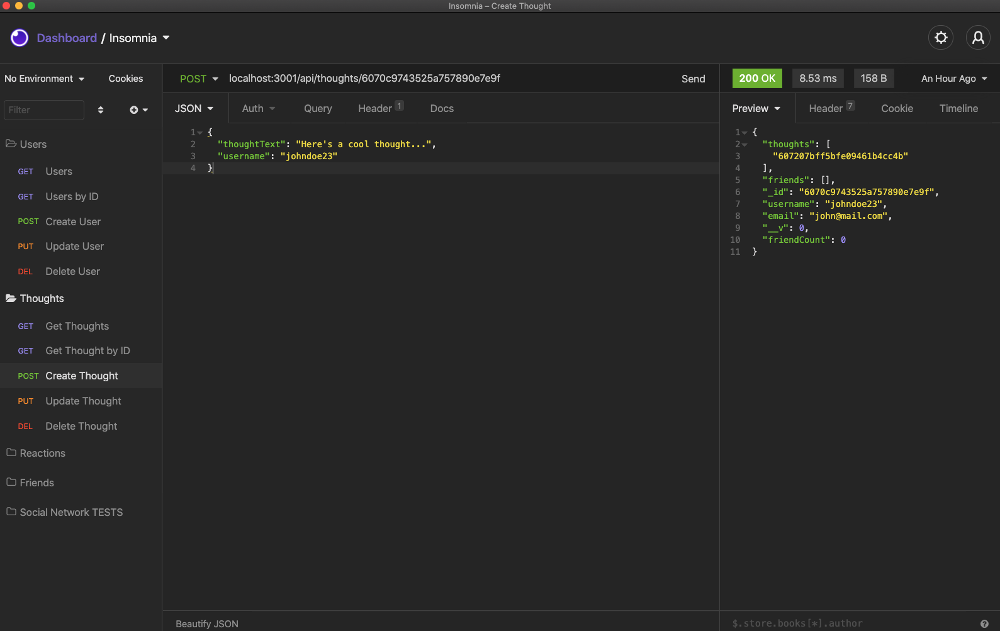
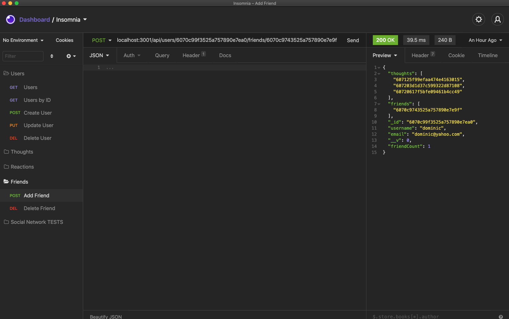

[](https://opensource.org/licenses/MIT)

  # Social Network API

  ## Description

  This project explores the use of a NoSQL database using Mongoose. This application demonstrates basic functionality for a simple social network whilst handling large amounts of unstructured data. This application allows CRUD functions to be applied to users, friends, thoughts(similar to user posts), and reactions on a particular user's thoughts.

  Links: 
  - [Video Demo Part 1](https://drive.google.com/file/d/11KupwCeET14oviXbpuoQY_WbSMLiFktJ/view)
  - [Video Demo part 2](https://drive.google.com/file/d/1odn1hVfy5AHzR5hpbwI5MgpN5EPh8JKw/view)


  ## Table of Contents

  * [Installation](#installation)
  * [Usage](#usage)
  * [License](#license)
  * [Contributing](#contributing)
  * [Test](#test)
  * [Questions](#questions)

  ### Installation
  
  ```
  npm i
  ```

  ### Usage

  Ensure that you have an API client installed such as insomnia or postman. Clone this repo, start the server using `npm start`, and use the following routes to try out the application:

   User routes
   - GET all users `localhost:3001/api/users`
   - GET user by Id `localhost:3001/api/users/:userId`
   - POST user `localhost:3001/api/users`
   - PUT user `localhost:3001/api/users/:userId`
   - DELETE `localhost:3001/api/users/:userId`

   Thought routes
   - GET all thoughts `localhost:3001/api/thoughts`
   - GET thought by Id `localhost:3001/api/thoughts/:userId`
   - POST thought `localhost:3001/api/thoughts`
   - PUT thought `localhost:3001/api/thoughts/:thoughtId`
   - DELETE `localhost:3001/api/thoughts/:thoughtId`

   Reaction routes
   - POST reaction `localhost:3001/api/:thoughtId/reactions`
   - DELETE reaction `localhost:3001/api/:thoughtId/reactions/:reactionId`

   Friend routes
   - POST('add') friend `localhost:3001/api/:id/friends/:friendId`
   - DELETE friend `localhost:3001/api/:id/friends/:friendId`


  ### License
  This project is licensed under [MIT](https://opensource.org/licenses/MIT)

  ### Contributing
  
  No contributions at the moment

  ### Tests
  
  ```
  N/A
  ```

  ## Questions
  
  If you have any questions about the repo, please contact me at j.taylor1343@gmail.com.

  You can find more of my work and projects at [johannt91](https://github.com/johannt91).

## Screenshots

Get all users


Creating a user using post method


Getting user thoughts


Creating user thoughts using post method


Adding a friend to the friends list

